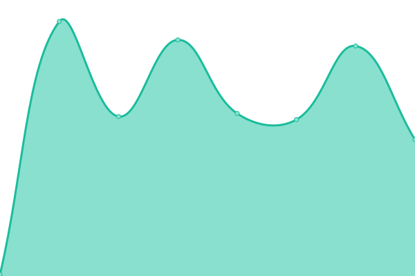
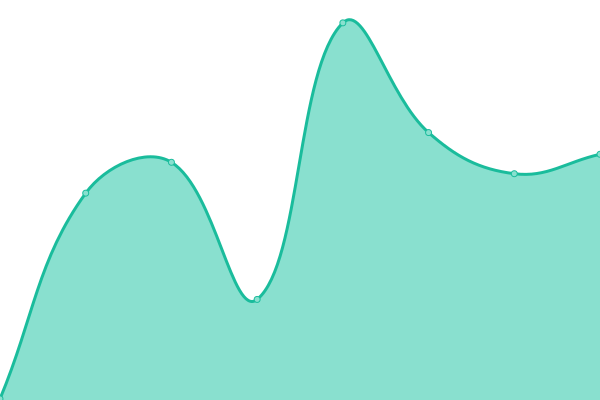

# [📈 Live Status](https://upptime.ironcorelabs.com): <!--live status--> **🟩 All systems operational**

This repository contains the open-source uptime monitor and status page for [IronCore Labs](https://ironcorelabs.com), powered by [Upptime](https://github.com/upptime/upptime).

With [Upptime](https://upptime.js.org), you can get your own unlimited and free uptime monitor and status page, powered entirely by a GitHub repository. We use [Issues](https://github.com/IronCoreLabs/upptime/issues) as incident reports, [Actions](https://github.com/IronCoreLabs/upptime/actions) as uptime monitors, and [Pages](https://upptime.ironcorelabs.com) for the status page.

<!--start: status pages-->
<!-- This summary is generated by Upptime (https://github.com/upptime/upptime) -->
<!-- Do not edit this manually, your changes will be overwritten -->
<!-- prettier-ignore -->
| URL | Status | History | Response Time | Uptime |
| --- | ------ | ------- | ------------- | ------ |
|  [Web site](https://ironcorelabs.com/) | 🟩 Up | [web-site.yml](https://github.com/IronCoreLabs/upptime/commits/HEAD/history/web-site.yml) | 

 191ms
     
 | 

<a href="https://upptime.ironcorelabs.com/history/web-site">60.17%</a>
    

|  [IronCore Identity service](https://api.ironcorelabs.com/api/health) | 🟩 Up | [iron-core-identity-service.yml](https://github.com/IronCoreLabs/upptime/commits/HEAD/history/iron-core-identity-service.yml) | 

 191ms
     
 | 

<a href="https://upptime.ironcorelabs.com/history/iron-core-identity-service">100.00%</a>
    

|  [Admin Console](https://admin.ironcorelabs.com/api/health) | 🟩 Up | [admin-console.yml](https://github.com/IronCoreLabs/upptime/commits/HEAD/history/admin-console.yml) | 

 189ms
     
 | 

<a href="https://upptime.ironcorelabs.com/history/admin-console">100.00%</a>
    

|  [Config Broker](https://config.ironcorelabs.com/health) | 🟩 Up | [config-broker.yml](https://github.com/IronCoreLabs/upptime/commits/HEAD/history/config-broker.yml) | 

 170ms
     
 | 

<a href="https://upptime.ironcorelabs.com/history/config-broker">60.17%</a>
    

|  [Config Broker (static content)](https://config.ironcorelabs.com/static/manifest.json) | 🟩 Up | [config-broker-static-content.yml](https://github.com/IronCoreLabs/upptime/commits/HEAD/history/config-broker-static-content.yml) | 

 75ms
     
 | 

<a href="https://upptime.ironcorelabs.com/history/config-broker-static-content">60.17%</a>
    

|  [Cloaked Search demo](https://cloaked-search.ironcorelabs.com/wikipedia/_search) | 🟩 Up | [cloaked-search-demo.yml](https://github.com/IronCoreLabs/upptime/commits/HEAD/history/cloaked-search-demo.yml) | 

 212ms
     
 | 

<a href="https://upptime.ironcorelabs.com/history/cloaked-search-demo">60.42%</a>
    

|  [Cloaked Search demo (backend search service)](https://search-service.ironcorelabs.com/wikipedia/_search?size=0) | 🟩 Up | [cloaked-search-demo-backend-search-service.yml](https://github.com/IronCoreLabs/upptime/commits/HEAD/history/cloaked-search-demo-backend-search-service.yml) | 

 158ms
     
 | 

<a href="https://upptime.ironcorelabs.com/history/cloaked-search-demo-backend-search-service">60.42%</a>
    

|  [SaaS Shield for S3 demo](https://saas-shield-for-s3-demo.ironcorelabs.com/healthz) | 🟩 Up | [saa-s-shield-for-s3-demo.yml](https://github.com/IronCoreLabs/upptime/commits/HEAD/history/saa-s-shield-for-s3-demo.yml) | 

 233ms
     
 | 

<a href="https://upptime.ironcorelabs.com/history/saa-s-shield-for-s3-demo">100.00%</a>
    

<!--end: status pages-->

[**Visit our status website →**](https://upptime.ironcorelabs.com)

## 📄 License

- Powered by: [Upptime](https://github.com/upptime/upptime)
- Code: [MIT](./LICENSE) © [IronCore Labs](https://ironcorelabs.com)
- Data in the `./history` directory: [Open Database License](https://opendatacommons.org/licenses/odbl/1-0/)
